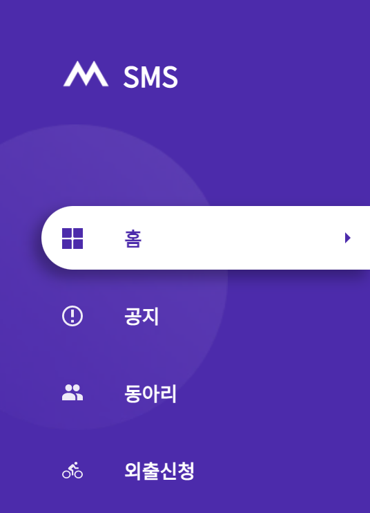
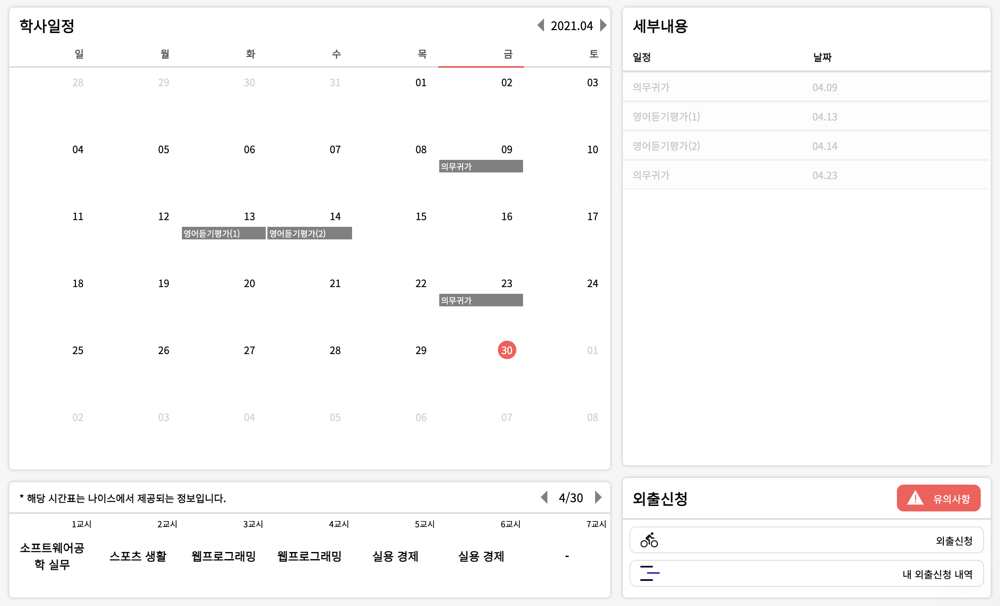
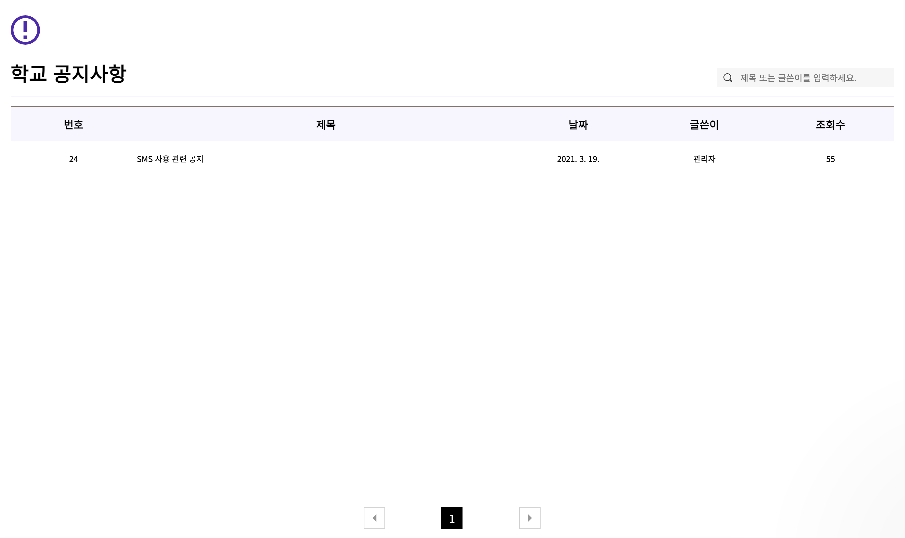
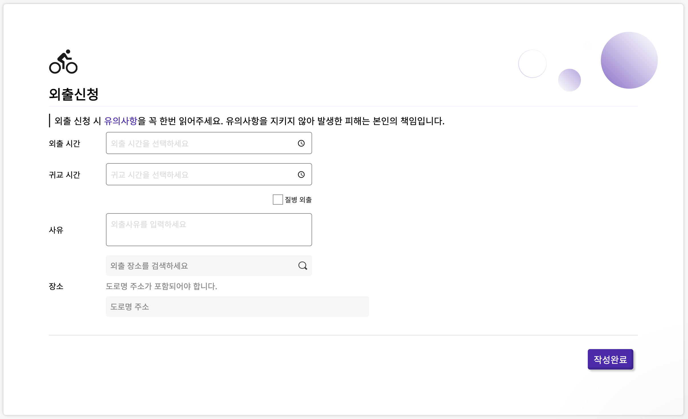
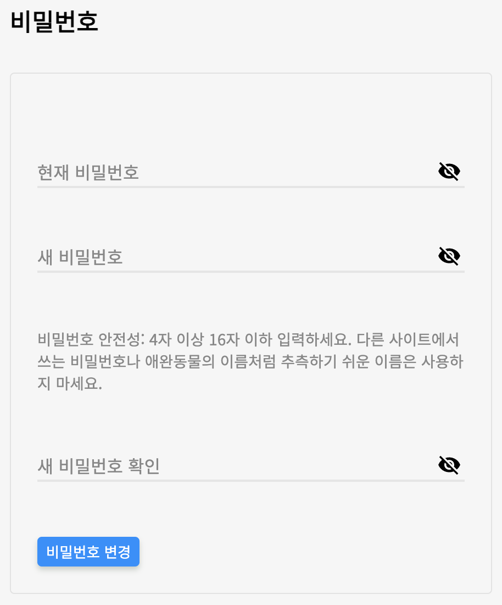

# SMS-Front-V1

SMS(School Management System)란 대덕소프트웨어마이스터고등학교 인프라넷 중 학사일정, 시간표, 외출증, 공지사항 관련 기능을 제공하기 위한 시스템이다.

## 스크린샷

  

    대덕소프트웨어마이스터고등학교 학교 생활 및 외출을 온라인으로 관리하는 시스템입니다.
  

  

    네비게이션
  

  

  

    학사일정과 학사일정의 세부내용 그리고 시간표를 볼 수 있는 메인 페이지입니다.
  

  

  

    학교 공지사항을 확인할 수 있는 페이지입니다.
  

  

  

    외출을 신청하는 페이지입니다.
  

  

  

    외출을 신청하는 페이지입니다.
  

  

## Technical Stack

### Software Stack

- Webpack (for bundle)
- Typescript (for static type and high productivity)
- React (for building UI)
- Redux (for management global state)
- Redux-Saga (for asynchronous on redux)
- styled-components (for styling)

### CI/CD

- Github Action
